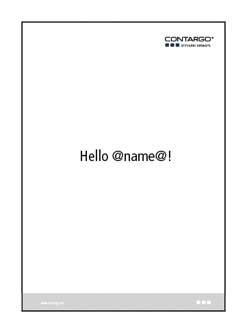
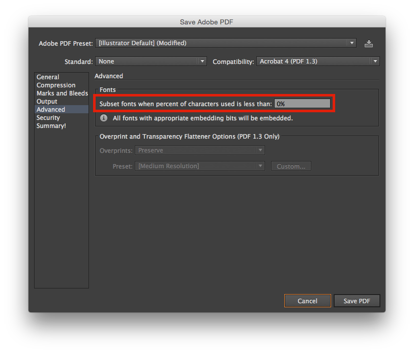
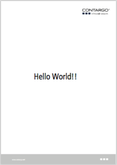

Creating a simple PDF document
==============================

In this guide we will show you, step-by-step, how to create a PDF-document,
using the PDF-Builder, from a document-template, with a text placeholder that
is replaced by the application.

## What you'll build

A very simple simple Java application that generates a beautiful PDF-document
from the command-line.

## What you'll need

* JDK 8 or later
* Maven 3
* Adobe Illustrator (see below)

> NOTE: At the time of writing, the author knows of no other application that
        provides the level of control for template authoring that is required.
        More on this later.

## Create a Maven project

Start by creating a new Maven project by creating the following basic `pom.xml`
file, with the PDF-Builder dependency included.

    <?xml version="1.0" encoding="UTF-8"?>
    <project>
        <modelVersion>4.0.0</modelVersion>

        <groupId>net.contargo.pdf</groupId>
        <artifactId>simple</artifactId>
        <version>0.0.1-SNAPSHOT</version>

        <dependencies>
            <dependency>
                <groupId>net.contargo.print</groupId>
                <artifactId>pdf-builder</artifactId>
                <version>RELEASE</version>
            </dependency>
        </dependencies>
    </project>

> NOTE: For production projects, make sure to choose a proper release version
        from the [Contargo Nexus Server](https://nexus-contargo.synyx.de).

## Add a main-class

Create the following Java-class as `src/main/java/Simple.java`, with a small
`main`-method.

    import net.contargo.print.pdf.PDFBuilder;

    public class Simple {

      public static void main(String[] args) throws Exception {

        PDFBuilder.fromTemplate(System.in)
          .withReplacement("@name@", "World")
          .build()
          .save(System.out);
      }
    }

In this example we've created a command-line tool, that will read a PDF-template
from `STDIN` and save the rendered PDF document results back out to `STDOUT`.

The call to `.withReplacement("@name@", "World")` tells the PDF-Builder to
search for any occurrence of the string `@name@` and replace it with the text
`World`.

## Create the PDF template

We now need to create a PDF-template file, so we open Adobe Illustrator and
create a pretty A4 letter, branded with the corporate logo, adding the text and
placeholder `Hello @name@!`.

Save the template file as `template.pdf` in the project root directory.

> ** All PDF templates requires a fully embedded set of font glyphs. To ensure
     this choose `Save as` in Adobe Illustrator and `Adobe PDF (pdf)` as file
     type. Then make sure to set the `Advanced -> Fonts` setting as shown
     below: **

## Building an executable JAR

Now add the following `maven-assembly-plugin` configuration to the `pom.xml`
file, in order to build and package the project as an executable JAR-file.

      ...
      </dependencies>

      <build>
          <plugins>
              <plugin>
                  <groupId>org.apache.maven.plugins</groupId>
                  <artifactId>maven-assembly-plugin</artifactId>
                  <configuration>
                      <finalName>${project.artifactId}</finalName>
                      <appendAssemblyId>false</appendAssemblyId>
                      <descriptorRefs>
                          <descriptorRef>jar-with-dependencies</descriptorRef>
                      </descriptorRefs>
                      <archive>
                          <manifest>
                              <mainClass>Simple</mainClass>
                          </manifest>
                      </archive>
                  </configuration>
              </plugin>
          </plugins>
      </build>
    </project>

You can now build the `target/simple.jar` JAR-file with the bundled
dependencies by running:

    $ mvn compile assembly:single

## Generate the PDF

Now we can execute our simple example, passing the `template.pdf` as input, and
save the output into a new PDF-file called `result.pdf`.

    $ java -jar target/simple.jar < template.pdf > result.pdf

And the result is our template with the placeholder `@name@` replaced.

